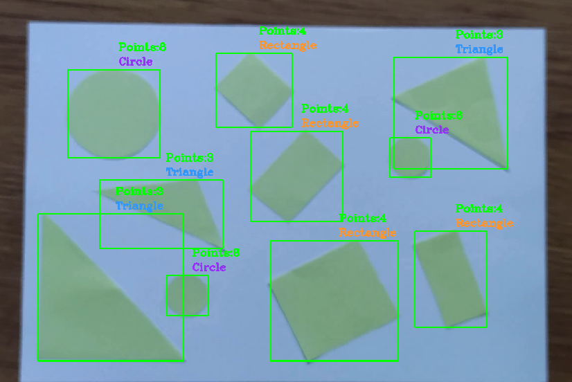

# shapes_detection

**OpenCV** (Open Source Computer Vision Library) is a library of programming functions mainly aimed at real-time computer vision.

First, I created a TrackBar to find the color of the shapes. For further work, the parameters were fixed.

Then using **cv2.findContour()** were defined contours of shapes in video. In the video, they were outlined in green boxes.
And depending on the number of points, the shapes were classified into 3 groups: Triangle (3 points), Rectangle (4 points), Circle (other).

After that, video with detected shapes was saved with **cv2.VideoWriter()**. You can see the detection result in this image:

This code may misclassify shapes if they are partially visible.
